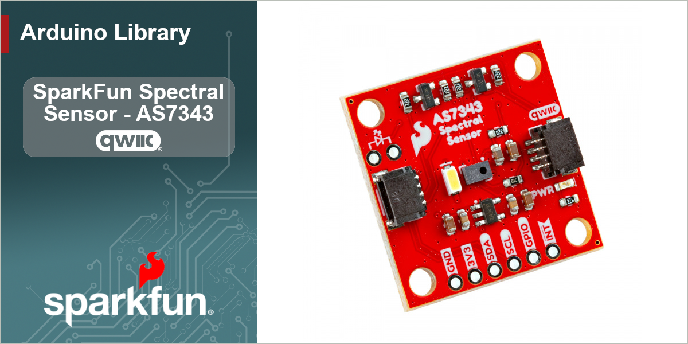

# SparkFun Spectral Sensor AS7343 Arduino Library

Arduino Library for the SparkFun Spectral Sensor - AS7343 (QWIIC)

This library provides full access to the functions of the AS7343 Spectral Sensor through an I2C connection using the SparkFun Qwiic connectors and cables. Interrupt features can also be utilized by soldering tot he INT pin on the 0.1-inch PTH headers.

### Supported Products
This library is intended for use with the following SparkFun Product - available at [www.sparkfun.com](https://www.sparkfun.com). 

| Product | Description|
|--|--|
|[SparkFun Spectral Sensor - AS7343 (Qwiic)](https://www.sparkfun.com/products/23220) | The SparkFun AS7343 Qwiic Spectral Sensor enables users to measure 14 channels of spectral data including both the visible spectrum (VIS) and near-infrared (NIR) ranges, all on a single IC in a compact package. The AS7343 exhibits exceptional sensitivity across its sensing spectrum (~380nm to 1000nm) and operates reliably in low-light environments, including when measuring through tinted glass.|

## Documentation

|Reference | Description |
|---|---|
|[Library Documentation](https://docs.sparkfun.com/SparkFun_AS7343_Arduino_Library/)| The full documentation and API for this Arduino library|
|[SparkFun Spectral Sensor - AS7343 (Qwiic)](https://github.com/sparkfun/SparkFun_Spectral_Sensor_Breakout_AS7343_Qwiic/)| Hardware GitHub Repository|
|[Hook Up Guide - SparkFun Spectral Sensor - AS7343 (Qwiic)](https://docs.sparkfun.com/SparkFun_Spectral_Sensor_Breakout_AS7343_Qwiic/) | Hardware Overview and Quick Start for the SparkFun Spectral Sensor - AS7343 (Qwiic)|
|[AS7343 Datasheet](https://cdn.sparkfun.com/assets/e/f/3/6/c/AS7343_DS001046_6-00.pdf) | Datasheet for the AS7343 IC|
|[Installing an Arduino Library Guide](https://learn.sparkfun.com/tutorials/installing-an-arduino-library)| Basic information on how to install an Arduino library|

## Examples

The following examples are provided with the library

| Example | Description |
|---|---|
|[Basic Readings](examples/Example_01_BasicReadings/Example_01_BasicReadings.ino)| Take basic readings from the sensor (reg/green/blue) and print them to the terminal.|
|[All Channels](examples/Example_02_AllChannels/Example_02_AllChannels.ino)| Take readings of all channels of data from the sensor and print them to the terminal.|
|[Gain](examples/Example_03_Gain/Example_03_Gain.ino)| Demonstrates how to adjust the gain of the sensor (making it more or less sensitive).|
|[Interrupt](examples/Example_04_Interrupt)| Shows how to set up a threshold and trigger an interrupt when the light reading crosses that threshold.|
|[Flicker Detection](examples/Example_05_FlickerDetection/Example_05_FlickerDetection.ino)| Demonstrates how to setup and use flicker detection. Prints status of detection to terminal. |
|[Sleep](examples/Example_06_Sleep/Example_06_Sleep.ino)| Shows how to put the sensor into sleep while not taking a reading to save power.|
|[Web Terminal Bar Graphs](examples/Example_07_WebTerminal_BarGraphs/Example_07_WebTerminal_BarGraphs.ino)| Outputs data in CSV to match nicely with the [SparkFun WebSerialPlotter tool](https://docs.sparkfun.com/SparkFun_WebSerialPlotter/).|

## License Information

This product is ***open source***!

This product is licensed using the [MIT Open Source License](https://opensource.org/license/mit).

[def]: examples